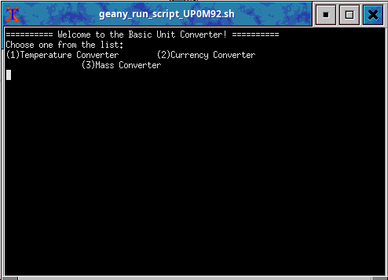
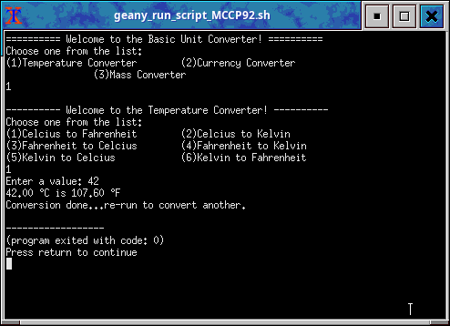
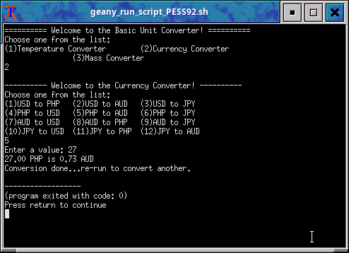
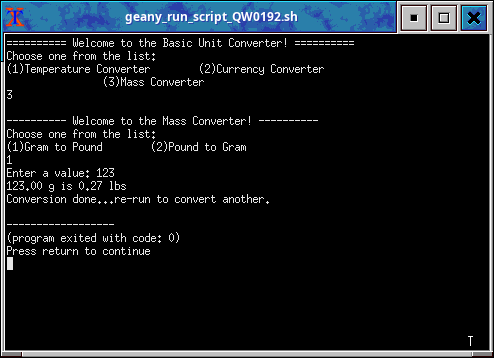

# AIO converter

Converts various units of temperature, mass, and currency. Some minor error handling are also applied.

## Screenshots


<br>



## Installation
Clone the repository
```
git clone https://codeberg.org/bochard/AIO-converter.git
```

## Usage
1. Open the folder
```
cd path/to/AIO-converter/
```
2. Compile
```
gcc -o main main.c
```
3. Run
```
./main
```
4. be happy.

---
